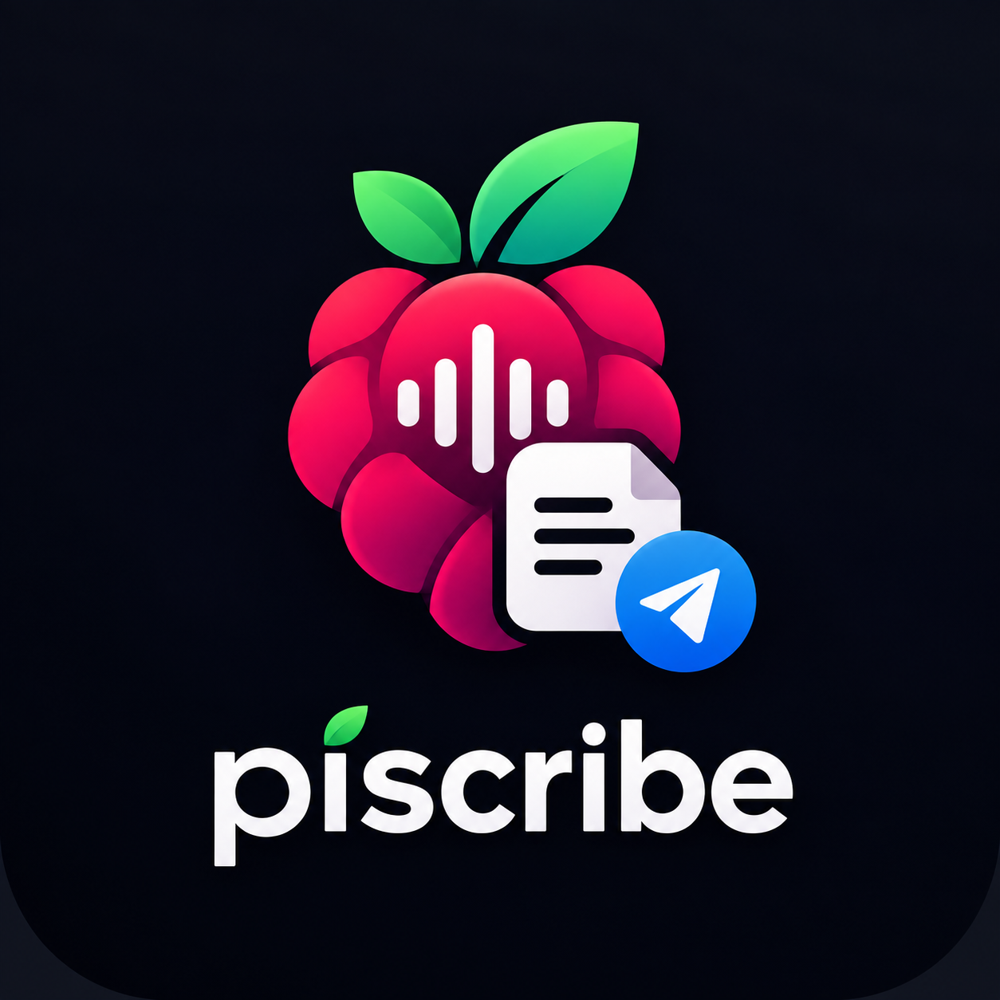
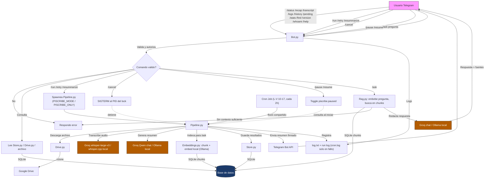

# piscribe



**Current version:** [v1.0.0](CHANGELOG.md) — see [CHANGELOG.md](CHANGELOG.md) for release notes.

A lightweight pipeline that watches a Google Drive folder for meeting recordings or
notes, transcribes them, generates a detailed Spanish summary, and delivers the
result to Telegram. Transcription and summarization try Groq's hosted models
first and fall back automatically to the local `whisper.cpp` / Ollama stack on
any failure — or run fully local if no `GROQ_API_KEY` is configured. Built to
run unattended from cron on a Raspberry Pi, with an optional Telegram bot for
status queries and manual runs.

## Overview

`piscribe` is designed to run unattended on a Raspberry Pi (e.g. from a cron job).
On each run it:

1. Lists the files waiting in a Google Drive "pending" folder via [`rclone`](https://rclone.org/).
2. Downloads each file locally and moves it to a "processed" folder in Drive so it
   is not handled twice.
3. Extracts the content:
   - **Video** (`.mp4`, `.mov`, `.mkv`, `.avi`) &rarr; audio is extracted, then
     transcribed with **Groq's hosted `whisper-large-v3`** first; any failure
     (no key configured, network, rate limit, oversized file, ...) falls back to
     the local [`whisper.cpp`](https://github.com/ggerganov/whisper.cpp) binary.
   - **Text** (`.txt`, `.md`) &rarr; read directly.
4. Summarizes the text, again **Groq-first with a local fallback** — a hosted Qwen
   chat model on Groq, or the local [Qwen](https://ollama.com/library/qwen3) model
   served by [Ollama](https://ollama.com/) — asking for a detailed, structured
   Spanish summary (synthesis, key points, decisions, commitments with
   owner/deadline, risks, open items), attributing statements to a speaker only
   when the transcript makes that identifiable. If Groq rejects the request
   for being too large for its free-tier output-tokens-per-minute limit, it's
   retried split into chunks (`GROQ_CHUNK_CHARS` each) — each summarized on
   its own, then combined with one more Groq call — instead of falling back
   to local right away. This raises how much a single meeting can ask of
   Groq; a meeting still too large after that (or any other Groq failure)
   falls back to local as before.
5. Posts the summary to one or more Telegram chats through the Bot API, signed
   with which engine transcribed and summarized it (e.g. `_resumen: Groq ·
   qwen/qwen3.8-27b_` or `_resumen: local · Ollama qwen3:1.7b_`).
6. Cleans up the local download, archives the transcript, records the run (and
   which engine handled each stage) in a SQLite history, and writes a per-run log.
7. Indexes the transcript and summary for `/ask`: both are chunked and embedded
   locally via Ollama (`EMBED_MODEL`, default `nomic-embed-text`), and the
   chunks are stored in SQLite for later semantic search — see
   [embeddings.py](embeddings.py). A failure here (e.g. Ollama down) is logged
   and never blocks delivery of the summary already sent in step 5.

Each stage above also pings Telegram — the run starting, each file's
download/transcription/summary step, and a wrap-up with the ok/total count —
with identical wording whether the run came from cron or from an on-demand
`/run`, `/retry` or `/resummarize`, so a failure is never silent. Only the
audience differs: cron has no requester, so it broadcasts to every chat in
`TG_CHAT_IDS`; an on-demand trigger goes ONLY to whoever asked for it — Juan
running `/run` doesn't put anything in Pedro's chat.

Groq is entirely optional: leave `GROQ_API_KEY` blank in `.env` and every run
uses the local `whisper.cpp` / Ollama stack only, with nothing leaving the host.
A separate long-polling bot (`bot.py`) answers `/status`, `/recap`,
`/transcript`, `/logs`, `/history`, `/ask` (semantic search over every
indexed transcript/summary) and can trigger a pass with `/run`.

## Features

- **Drive-driven queue** — drop a file in a folder, get a summary back. No UI needed.
- **Groq-first, local-fallback transcription and summarization** — tries Groq's
  hosted `whisper-large-v3` and Qwen chat model, and falls back automatically to
  `whisper.cpp` / Ollama on any failure (or always, if no `GROQ_API_KEY` is set).
- **Engine provenance** — every summary is signed with which backend produced it,
  and it's recorded in the SQLite history too.
- **`/ask <question>`** — semantic search over every indexed transcript and
  summary: the question is embedded locally, compared against indexed chunks
  by cosine similarity, and — only when something is actually relevant —
  answered by Groq (local Ollama fallback), citing which file(s) it drew
  from. Below the similarity threshold it says it found nothing rather than
  risk inventing an answer.
- **Always-Spanish summaries** regardless of the source language.
- **Multi-recipient Telegram delivery** with Markdown formatting.
- **Idempotent processing** — files are moved to a processed folder as soon as they
  are picked up.
- **Resilient batch runs** — a failure on one file is logged and does not stop the rest.
- **Live progress on Telegram** — every `run_pipeline` pass (cron or `/run`)
  announces the run starting, each file's stage (download/transcribe/summarize),
  and a wrap-up; a failed file is reported immediately, not just discovered
  later via `/status`.
- **Single-run lock** — cron and a bot `/run` can never overlap (`flock`).
- **Run history** in SQLite plus a per-run log file, queryable from Telegram.
- **UTC, level-aware logging** (`INFO`/`WARNING`/`ERROR`) to stdout, the rotating
  `~/whisper.cpp/log.txt`, and the run's own log file (auto-pruned after
  `RUN_LOG_RETENTION_DAYS`, default 30).

## Project layout

| File                                                                                | Responsibility                                                |
| ----------------------------------------------------------------------------------- | ------------------------------------------------------------- |
| [pipeline.py](pipeline.py)                                                          | Cron entry point; `run_pipeline()` orchestrates one pass      |
| [bot.py](bot.py)                                                                    | Telegram control bot (long-polling daemon)                    |
| [handlers.py](handlers.py)                                                          | Bot command handlers + authorization                          |
| [store.py](store.py)                                                                | SQLite run/file history (pipeline writes, bot reads)          |
| [runlock.py](runlock.py)                                                            | Cross-process `flock` run lock, records the holder PID        |
| [config.py](config.py)                                                              | Paths and environment configuration                           |
| [drive.py](drive.py)                                                                | `rclone` wrappers: list, download, move files in Drive        |
| [video.py](video.py)                                                                | Audio extraction; transcription via Groq `whisper-large-v3` with local `whisper.cpp` fallback |
| [text.py](text.py)                                                                  | Reads plain-text / Markdown inputs                            |
| [summary.py](summary.py)                                                            | Summary generation via Groq (Qwen chat) with local Ollama fallback |
| [embeddings.py](embeddings.py)                                                      | Sentence-bounded chunking + local Ollama embeddings for `/ask` |
| [rag.py](rag.py)                                                                    | `/ask` retrieval (cosine similarity) + Groq/local answer drafting |
| [telegram_api.py](telegram_api.py)                                                  | Outbound Bot API helpers (`curl`-based)                       |
| [utils.py](utils.py)                                                                | UTC, level-aware logging (rotation, per-run log files)         |
| [install.sh](install.sh)                                                            | Virtualenv, runtime dirs, `.env`, cron entry                  |
| [VERSION](VERSION)                                                                  | Current semantic version, shown by `/version`                 |
| [CHANGELOG.md](CHANGELOG.md)                                                        | Release notes (Keep a Changelog format)                       |
| [systemd/piscribe-bot.service](systemd/piscribe-bot.service)                        | User service unit for the bot                                 |
| [requirements.txt](requirements.txt) / [requirements-dev.txt](requirements-dev.txt) | Pinned runtime / test dependencies                            |
| [tests/](tests/)                                                                    | `pytest` suite (external tools stubbed)                       |
| [docs/google-drive-setup.md](docs/google-drive-setup.md)                            | One-time `rclone` + Google Drive OAuth setup                  |
| [docs/telegram-bot-setup.md](docs/telegram-bot-setup.md)                            | One-time Telegram bot + chat-id setup                         |

## Requirements

- Python 3.9+ with `python3-venv` (`sudo apt install python3-venv` on Raspberry Pi OS);
  developed and tested on **Python 3.13.5**
- Python packages from [requirements.txt](requirements.txt) (`python-dotenv`, `ollama`,
  `python-telegram-bot`, `groq`), installed into a virtualenv by `install.sh`
- [`git`](https://git-scm.com/)
- [`rclone`](https://rclone.org/) with a Google Drive remote — see
  [docs/google-drive-setup.md](docs/google-drive-setup.md)
- [`ffmpeg`](https://ffmpeg.org/)
- `curl` (used to call the Telegram Bot API)
- `cmake` and a C++ toolchain (to build `whisper.cpp`)
- [`whisper.cpp`](https://github.com/ggerganov/whisper.cpp) built at `~/whisper.cpp/`
  with a model at `~/whisper.cpp/models/ggml-small.bin`
- The [Ollama](https://ollama.com/) service installed and running, with the Qwen
  model and an embedding model (`nomic-embed-text` by default, for `/ask`)
  pulled (this is the native Ollama daemon/CLI, separate from the `ollama`
  Python package the pipeline uses to talk to it)
- A Telegram bot token and the target chat IDs — see
  [docs/telegram-bot-setup.md](docs/telegram-bot-setup.md)
- Optionally, a [Groq](https://console.groq.com/) API key to prefer their hosted
  `whisper-large-v3` and Qwen chat model over the local stack; leave it unset to
  run fully local. Free-tier per-minute token limits mean long meetings often
  fall back to local anyway — see the Notes below.

## Setup

The external tools (`rclone`, `whisper.cpp`, Ollama) are set up once by hand;
`install.sh` then handles the Python side and the `.env`.

1. **Configure `rclone`** with a Google Drive remote. Follow
   [docs/google-drive-setup.md](docs/google-drive-setup.md) — it creates the
   Google OAuth client, runs `rclone config`, and creates the `pendings` /
   `processed` folders in Drive.

2. **Build `whisper.cpp`** and download a model:

   ```bash
   git clone https://github.com/ggerganov/whisper.cpp ~/whisper.cpp
   cd ~/whisper.cpp && cmake -B build && cmake --build build --config Release
   sh ./models/download-ggml-model.sh small
   ```

3. **Install Ollama and pull the Qwen and embedding models.** This is the
   native Ollama service, not a Python package — no virtualenv involved:

   ```bash
   curl -fsSL https://ollama.com/install.sh | sh   # installs and starts the service
   ollama pull qwen3:1.7b
   ollama pull nomic-embed-text   # for /ask (see EMBED_MODEL)
   ```

4. **Create the Telegram bot** and note your chat id. Follow
   [docs/telegram-bot-setup.md](docs/telegram-bot-setup.md).

5. **Clone this project and run the installer:**

   ```bash
   git clone <repo-url> ~/piscribe
   cd ~/piscribe
   bash install.sh
   ```

   `install.sh` runs six steps: it fast-forwards the checkout, creates a
   virtualenv at `.venv/`, installs [requirements.txt](requirements.txt) into it,
   creates the runtime directories under `~/whisper.cpp/`, **prompts for each
   `.env` value**, and installs the cron entry (see below). For each variable it
   offers the current value (if `.env` already exists) or the default from
   `.env.example`; press Enter to accept it, or type a new value. An existing
   `.env` is backed up to `.env.bak` first.

   | Variable           | Description                                                  |
   | ------------------ | ------------------------------------------------------------ |
   | `TG_TOKEN`         | Telegram bot token from BotFather (required)                 |
   | `TG_CHAT_IDS`      | Comma-separated chat IDs to deliver summaries to (required)  |
   | `RCLONE_REMOTE`    | Name of the configured `rclone` remote (e.g. `gdrive`)       |
   | `PENDING_FOLDER`   | Drive folder to watch for new files                          |
   | `PROCESSED_FOLDER` | Drive folder that processed files are moved to               |
   | `QWEN_MODEL`       | Local Ollama model name used for summarization (e.g. `qwen3:1.7b`) |
   | `GROQ_API_KEY`     | Optional; blank disables Groq and runs fully local            |

   `GROQ_MODEL`, `GROQ_WHISPER_MODEL`, the Groq timeout/size-limit knobs, and the
   `/ask` RAG settings (`EMBED_MODEL`, `RAG_MIN_SIMILARITY`, `RAG_CHUNK_CHARS`,
   `RAG_CHUNK_OVERLAP_CHARS`, `RAG_TOP_K`) all have code defaults and are not
   prompted for — set them in `.env` only to override, see
   [.env.example](.env.example).

   > `install.sh` only touches the virtualenv, `~/whisper.cpp/`'s runtime
   > directories, and `.env`. The code stays in the checkout; re-run the script
   > any time to update dependencies or reconfigure `.env`.

## Usage

`pipeline.py` imports the other modules as top-level modules and `config.py`
loads `.env` from the current directory, so always run it from the checkout with
the virtualenv's Python.

Run a single pass over the pending folder:

```bash
cd ~/piscribe && .venv/bin/python pipeline.py
```

`install.sh` installs this cron entry — **Mon–Fri, 10:00–16:00, every 2 hours**:

```cron
0 10-17/2 * * 1-5 cd /home/pi/piscribe && /home/pi/piscribe/.venv/bin/python pipeline.py >/dev/null 2>>~/whisper.cpp/cron.log # piscribe
```

Edit the schedule with `crontab -e`; keep the trailing `# piscribe` marker so the
installer can update the line in place. Cron and a bot `/run` take a shared
`flock`, so overlapping invocations are skipped rather than run twice.

Then just upload a recording or a note to the Drive `pendings` folder and wait for
the summary to arrive in Telegram.

## Control bot (Telegram)

`bot.py` is an optional long-polling daemon — no inbound port, it holds an open
`getUpdates` request to Telegram and reacts as commands arrive. It only answers
the ids in `TG_CHAT_IDS` (`/whoami`, open to anyone, helps you find yours), and
**everyone in that list can use every command, `/run` and `/cancel` included** —
keep the chat private.

`#id` below is always a real database id, never a position — a run's id comes
from `/history`, a file's from `/find`. `/history`'s own `n` is a count of
rows to show, unrelated to any id.

| Command                      | Does                                                                            |
| ---------------------------- | ------------------------------------------------------------------------------- |
| `/status`                    | Run/pause state, last run, last success, free disk                              |
| `/recap [#id\|file]`         | Summary of a file by id (see `/find`; default latest)                           |
| `/transcript [#id\|file]`    | Original transcript, sent as a document                                         |
| `/logs [#id\|errors]`        | A run's log file by id (see `/history`; default latest), or its warning/error lines |
| `/history [n]`               | Compact list of the last `n` runs                                               |
| `/pending`                   | Files currently in the Drive pending folder                                     |
| `/stats`                     | Files / errors / runs / avg duration over the last 7 days                       |
| `/find <text>`               | Search filenames and summaries — shows each result's `#id`                      |
| `/ask <question>`            | Semantic search over indexed transcripts/summaries, answered by an LLM, with sources |
| `/version` `/whoami` `/help` | Checkout SHA + model / your ids / command list                                  |
| `/run [file]`                | Run now — whole pending folder, or one file; messages go only to you            |
| `/runcron [file]`            | Same as `/run`, but broadcasts to every chat in `TG_CHAT_IDS`, like cron does   |
| `/retry [#id\|file]`         | Reprocess a file (by id, see `/find`), re-fetched from the processed folder     |
| `/resummarize [#id\|file]`   | Re-run only the summary over the stored transcript (by id, see `/find`)         |
| `/cancel`                    | SIGTERM (then SIGKILL) the run in progress — cron or manual                     |
| `/pause` `/resume`           | Stop / restart processing (runs record as `skipped` while paused)               |

`/run`, `/runcron`, `/retry` and `/resummarize` spawn `pipeline.py` with
`PISCRIBE_*` environment variables, so a bot-triggered pass is recorded with
the caller's id (`PISCRIBE_BY`). `/run`, `/retry` and `/resummarize` record
`trigger=manual`, so their progress/result messages go only to the caller
(see `pipeline._targets`); `/runcron` forces `trigger=cron` instead, so it
broadcasts and even shows up in `/history` indistinguishable from a real
automated run — use it when the result matters to the whole team, not just
you. The bot posts a startup ping, and alerts the chats if no run has
succeeded for `DEADMAN_HOURS` (default 5) — plus a one-time "recovered"
notice once a run succeeds again.

Enable it as a user service:

```bash
mkdir -p ~/.config/systemd/user
cp systemd/piscribe-bot.service ~/.config/systemd/user/
systemctl --user daemon-reload
systemctl --user enable --now piscribe-bot
loginctl enable-linger "$USER"   # keep it running without an active login
```

Full walkthrough (creating the bot, the command menu, groups, troubleshooting):
[docs/telegram-bot-setup.md](docs/telegram-bot-setup.md).

## Tests

```bash
.venv/bin/pip install -r requirements-dev.txt
.venv/bin/python -m pytest
```

The suite in [tests/](tests/) stubs every external tool (rclone, ffmpeg, whisper,
Ollama, curl) and runs against a throwaway sandbox directory, so it needs no
network, no Drive, and no models. It covers the message splitter, the extension
filter, local-file cleanup on failure, the transcript guard, batch resilience,
the run lock, the SQLite store (history / search / stats / RAG chunks), `run` /
`retry` / `resummarize` / cancel handling, `/ask`'s chunking/embedding/retrieval
(`embeddings.py`, `rag.py`), and the bot's command handlers.

## How it works

```
  cron (Mon–Fri 10–16, /2h)          Telegram bot  (bot.py, long-poll)
        │                                  │  /run /retry /resummarize
        │  pipeline.py  ◄── flock ──────── │  (spawns pipeline.py, PISCRIBE_*)
        ▼                                  │
Google Drive (pendings/) ─ rclone ─►  local download
        │                                  │
        │           video? ─► ffmpeg ─► Groq whisper-large-v3 ─► transcript
        │                       │              │ (fail/no key)
        │                       │              ▼
        │                       │        local whisper.cpp ─► transcript
        │           text?  ─────────────────────────────────► file contents
        ▼                                  ▼
  move to processed/       Groq Qwen chat ─► Spanish summary
        │                       │ (fail/no key)
        │                       ▼
        │                 local Ollama + Qwen ─► Spanish summary
        ▼                                  ▼
  SQLite store + run log        Telegram Bot API ─► chat(s), signed with engine
        │                                  │
        ▼                                  │
  embeddings.py ─► SQLite chunks (Ollama embeddings, for /ask)
        ▲                                  │
        └─────────  bot reads  ◄───────────┘  /status /recap /transcript /logs …
                                               /ask ─► rag.py: search chunks,
                                               Groq/local ─► answer + sources
```



## Notes & limitations

- Only `.mp4`, `.mov`, `.mkv`, `.avi`, `.txt`, and `.md` files are picked up; anything
  else in the folder is ignored.
- The summary prompt and output language are hard-coded to Spanish in
  [summary.py](summary.py).
- Groq's free tier has generous **daily** limits but a tight **per-minute** token
  cap; a full-length meeting summary can exceed it on a single request, so on the
  free tier the summary step often falls back to local Ollama — by design, not a
  bug. Transcription rarely hits Groq's audio limits at a few meetings a day.
- Each processed file records which engine transcribed and summarized it
  (`transcribe_backend`/`summarize_backend` in the SQLite store) and the
  Telegram message is signed with both, so you can see when a run fell back.
- `/ask` indexing/retrieval is always local (Ollama `EMBED_MODEL`), regardless
  of `GROQ_API_KEY` — Groq has no embeddings API. Only `/run`/`/runcron`/cron
  and `/retry` re-index the transcript; `/resummarize` re-indexes just the
  summary. Search is a brute-force cosine-similarity scan over every chunk
  in SQLite (no vector index) — fine at the scale of a few meetings a day,
  but it doesn't scale indefinitely.
- A `flock` at `~/whisper.cpp/piscribe.lock` serializes runs; a pass that can't
  take it exits without working (it does not queue).
- `touch ~/whisper.cpp/piscribe.paused` makes runs record as `skipped` without
  processing; delete it to resume.
- Anyone in `TG_CHAT_IDS` can use every bot command, including `/run`. Keep the
  chat private and the allowlist tight.
- Secrets live in `.env`, which is git-ignored. Rotate any token that has been
  committed or shared.
