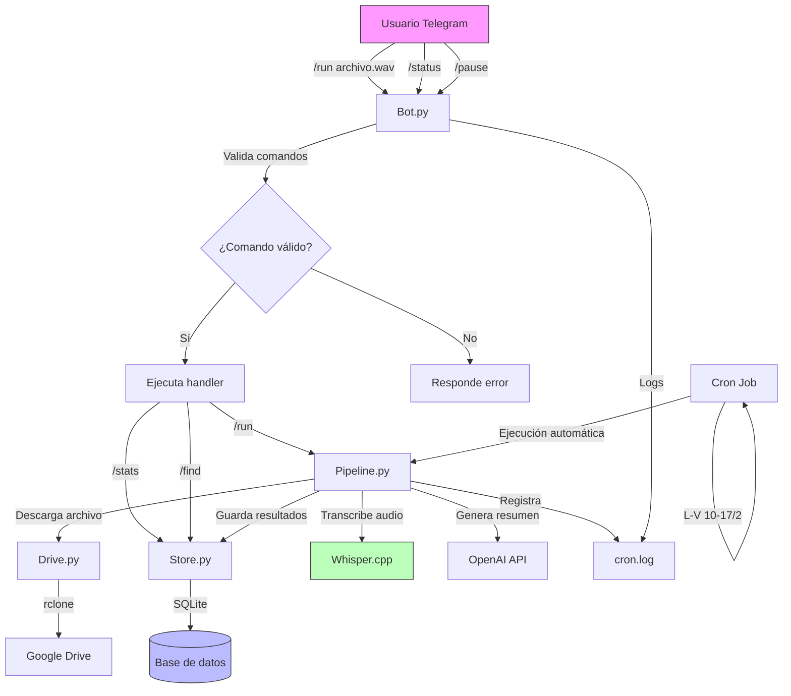

# piscribe


A lightweight pipeline that watches a Google Drive folder for meeting recordings or
notes, transcribes them locally, generates a concise Spanish summary with a local
LLM, and delivers the result to Telegram. Built to run unattended from cron on a
Raspberry Pi, with an optional Telegram bot for status queries and manual runs.

## Overview

`piscribe` is designed to run unattended on a Raspberry Pi (e.g. from a cron job).
On each run it:

1. Lists the files waiting in a Google Drive "pending" folder via [`rclone`](https://rclone.org/).
2. Downloads each file locally and moves it to a "processed" folder in Drive so it
   is not handled twice.
3. Extracts the content:
   - **Video** (`.mp4`, `.mov`, `.mkv`, `.avi`) &rarr; audio is extracted with
     `ffmpeg` and transcribed with [`whisper.cpp`](https://github.com/ggerganov/whisper.cpp).
   - **Text** (`.txt`, `.md`) &rarr; read directly.
4. Sends the transcript to a local [Qwen](https://ollama.com/library/qwen3) model
   served by [Ollama](https://ollama.com/) and asks for a clear, concise summary in
   Spanish highlighting key points, decisions, and open items.
5. Posts the summary to one or more Telegram chats through the Bot API.
6. Cleans up the local download, archives the transcript, records the run in a
   SQLite history, and writes a per-run log.

Everything runs on your machine — transcription and summarization never leave the
host. A separate long-polling bot (`bot.py`) answers `/status`, `/recap`,
`/transcript`, `/logs`, `/history` and can trigger a pass with `/run`.

## Features

- **Drive-driven queue** — drop a file in a folder, get a summary back. No UI needed.
- **Local transcription** with `whisper.cpp` and automatic language detection.
- **Local summarization** with a small Qwen model via Ollama (no API keys, no cloud).
- **Always-Spanish summaries** regardless of the source language.
- **Multi-recipient Telegram delivery** with Markdown formatting.
- **Idempotent processing** — files are moved to a processed folder as soon as they
  are picked up.
- **Resilient batch runs** — a failure on one file is logged and does not stop the rest.
- **Single-run lock** — cron and a bot `/run` can never overlap (`flock`).
- **Run history** in SQLite plus a per-run log file, queryable from Telegram.
- **Timestamped logging** to stdout, `~/whisper.cpp/log.txt`, and the run's own log.

## Project layout

| File                                                                                | Responsibility                                                |
| ----------------------------------------------------------------------------------- | ------------------------------------------------------------- |
| [pipeline.py](pipeline.py)                                                          | Cron entry point; `run_pipeline()` orchestrates one pass      |
| [bot.py](bot.py)                                                                    | Telegram control bot (long-polling daemon)                    |
| [handlers.py](handlers.py)                                                          | Bot command handlers + authorization                          |
| [store.py](store.py)                                                                | SQLite run/file history (pipeline writes, bot reads)          |
| [runlock.py](runlock.py)                                                            | Cross-process `flock` run lock, records the holder PID        |
| [config.py](config.py)                                                              | Paths and environment configuration                           |
| [drive.py](drive.py)                                                                | `rclone` wrappers: list, download, move files in Drive        |
| [video.py](video.py)                                                                | Audio extraction (`ffmpeg`) and transcription (`whisper.cpp`) |
| [text.py](text.py)                                                                  | Reads plain-text / Markdown inputs                            |
| [summary.py](summary.py)                                                            | Summary generation via Ollama / Qwen                          |
| [telegram_api.py](telegram_api.py)                                                  | Outbound Bot API helpers (`curl`-based)                       |
| [utils.py](utils.py)                                                                | Timestamped logging helper                                    |
| [install.sh](install.sh)                                                            | Virtualenv, runtime dirs, `.env`, cron entry                  |
| [systemd/piscribe-bot.service](systemd/piscribe-bot.service)                        | User service unit for the bot                                 |
| [requirements.txt](requirements.txt) / [requirements-dev.txt](requirements-dev.txt) | Pinned runtime / test dependencies                            |
| [tests/](tests/)                                                                    | `pytest` suite (external tools stubbed)                       |
| [docs/google-drive-setup.md](docs/google-drive-setup.md)                            | One-time `rclone` + Google Drive OAuth setup                  |
| [docs/telegram-bot-setup.md](docs/telegram-bot-setup.md)                            | One-time Telegram bot + chat-id setup                         |

## Requirements

- Python 3.9+ with `python3-venv` (`sudo apt install python3-venv` on Raspberry Pi OS);
  developed and tested on **Python 3.13.5**
- Python packages from [requirements.txt](requirements.txt) (`python-dotenv`, `ollama`,
  `python-telegram-bot`), installed into a virtualenv by `install.sh`
- [`git`](https://git-scm.com/)
- [`rclone`](https://rclone.org/) with a Google Drive remote — see
  [docs/google-drive-setup.md](docs/google-drive-setup.md)
- [`ffmpeg`](https://ffmpeg.org/)
- `curl` (used to call the Telegram Bot API)
- `cmake` and a C++ toolchain (to build `whisper.cpp`)
- [`whisper.cpp`](https://github.com/ggerganov/whisper.cpp) built at `~/whisper.cpp/`
  with a model at `~/whisper.cpp/models/ggml-small.bin`
- The [Ollama](https://ollama.com/) service installed and running, with the Qwen
  model pulled (this is the native Ollama daemon/CLI, separate from the `ollama`
  Python package the pipeline uses to talk to it)
- A Telegram bot token and the target chat IDs — see
  [docs/telegram-bot-setup.md](docs/telegram-bot-setup.md)

## Setup

The external tools (`rclone`, `whisper.cpp`, Ollama) are set up once by hand;
`install.sh` then handles the Python side and the `.env`.

1. **Configure `rclone`** with a Google Drive remote. Follow
   [docs/google-drive-setup.md](docs/google-drive-setup.md) — it creates the
   Google OAuth client, runs `rclone config`, and creates the `pendings` /
   `processed` folders in Drive.

2. **Build `whisper.cpp`** and download a model:

   ```bash
   git clone https://github.com/ggerganov/whisper.cpp ~/whisper.cpp
   cd ~/whisper.cpp && cmake -B build && cmake --build build --config Release
   sh ./models/download-ggml-model.sh small
   ```

3. **Install Ollama and pull the Qwen model.** This is the native Ollama
   service, not a Python package — no virtualenv involved:

   ```bash
   curl -fsSL https://ollama.com/install.sh | sh   # installs and starts the service
   ollama pull qwen3:1.7b
   ```

4. **Create the Telegram bot** and note your chat id. Follow
   [docs/telegram-bot-setup.md](docs/telegram-bot-setup.md).

5. **Clone this project and run the installer:**

   ```bash
   git clone <repo-url> ~/piscribe
   cd ~/piscribe
   bash install.sh
   ```

   `install.sh` runs six steps: it fast-forwards the checkout, creates a
   virtualenv at `.venv/`, installs [requirements.txt](requirements.txt) into it,
   creates the runtime directories under `~/whisper.cpp/`, **prompts for each
   `.env` value**, and installs the cron entry (see below). For each variable it
   offers the current value (if `.env` already exists) or the default from
   `.env.example`; press Enter to accept it, or type a new value. An existing
   `.env` is backed up to `.env.bak` first.

   | Variable           | Description                                                  |
   | ------------------ | ------------------------------------------------------------ |
   | `TG_TOKEN`         | Telegram bot token from BotFather (required)                 |
   | `TG_CHAT_IDS`      | Comma-separated chat IDs to deliver summaries to (required)  |
   | `RCLONE_REMOTE`    | Name of the configured `rclone` remote (e.g. `gdrive`)       |
   | `PENDING_FOLDER`   | Drive folder to watch for new files                          |
   | `PROCESSED_FOLDER` | Drive folder that processed files are moved to               |
   | `QWEN_MODEL`       | Ollama model name used for summarization (e.g. `qwen3:1.7b`) |

   > `install.sh` only touches the virtualenv, `~/whisper.cpp/`'s runtime
   > directories, and `.env`. The code stays in the checkout; re-run the script
   > any time to update dependencies or reconfigure `.env`.

## Usage

`pipeline.py` imports the other modules as top-level modules and `config.py`
loads `.env` from the current directory, so always run it from the checkout with
the virtualenv's Python.

Run a single pass over the pending folder:

```bash
cd ~/piscribe && .venv/bin/python pipeline.py
```

`install.sh` installs this cron entry — **Mon–Fri, 10:00–16:00, every 2 hours**:

```cron
0 10-17/2 * * 1-5 cd /home/pi/piscribe && /home/pi/piscribe/.venv/bin/python pipeline.py >> ~/whisper.cpp/cron.log 2>&1 # piscribe
```

Edit the schedule with `crontab -e`; keep the trailing `# piscribe` marker so the
installer can update the line in place. Cron and a bot `/run` take a shared
`flock`, so overlapping invocations are skipped rather than run twice.

Then just upload a recording or a note to the Drive `pendings` folder and wait for
the summary to arrive in Telegram.

## Control bot (Telegram)

`bot.py` is an optional long-polling daemon — no inbound port, it holds an open
`getUpdates` request to Telegram and reacts as commands arrive. It only answers
the ids in `TG_CHAT_IDS` (`/whoami`, open to anyone, helps you find yours), and
**everyone in that list can use every command, `/run` and `/cancel` included** —
keep the chat private.

| Command                      | Does                                                                            |
| ---------------------------- | ------------------------------------------------------------------------------- |
| `/status`                    | Run/pause state, last run, last success, free disk                              |
| `/recap [n\|file]`           | Summary of the n-th most recent file (default 1)                                |
| `/transcript [n\|file]`      | Original transcript, sent as a document                                         |
| `/logs [n\|errors]`          | A run's log file, or just its error/warning lines                               |
| `/history [n]`               | Compact list of recent runs                                                     |
| `/pending`                   | Files currently in the Drive pending folder                                     |
| `/stats`                     | Files / errors / runs / avg duration over the last 7 days                       |
| `/find <text>`               | Search filenames and summaries                                                  |
| `/version` `/whoami` `/help` | Checkout SHA + model / your ids / command list                                  |
| `/run [file]`                | Run now — whole pending folder, or one file; refused while a run holds the lock |
| `/retry [n\|file]`           | Reprocess a file, re-fetched from the processed folder                          |
| `/resummarize [n\|file]`     | Re-run only the summary over the stored transcript                              |
| `/cancel`                    | SIGTERM (then SIGKILL) the run in progress — cron or manual                     |
| `/pause` `/resume`           | Stop / restart processing (runs record as `skipped` while paused)               |

`/run`, `/retry` and `/resummarize` spawn `pipeline.py` with `PISCRIBE_*`
environment variables, so a bot-triggered pass is recorded with `trigger=manual`
and the caller's id. The bot posts a startup ping, and alerts the chats if no run
has succeeded for `DEADMAN_HOURS` (default 5) — plus a one-time "recovered" notice
once a run succeeds again.

Enable it as a user service:

```bash
mkdir -p ~/.config/systemd/user
cp systemd/piscribe-bot.service ~/.config/systemd/user/
systemctl --user daemon-reload
systemctl --user enable --now piscribe-bot
loginctl enable-linger "$USER"   # keep it running without an active login
```

Full walkthrough (creating the bot, the command menu, groups, troubleshooting):
[docs/telegram-bot-setup.md](docs/telegram-bot-setup.md).

## Tests

```bash
.venv/bin/pip install -r requirements-dev.txt
.venv/bin/python -m pytest
```

The suite in [tests/](tests/) stubs every external tool (rclone, ffmpeg, whisper,
Ollama, curl) and runs against a throwaway sandbox directory, so it needs no
network, no Drive, and no models. It covers the message splitter, the extension
filter, local-file cleanup on failure, the transcript guard, batch resilience,
the run lock, the SQLite store (history / search / stats), `run` / `retry` /
`resummarize` / cancel handling, and the bot's command handlers.

## How it works

```
  cron (Mon–Fri 10–16, /2h)          Telegram bot  (bot.py, long-poll)
        │                                  │  /run /retry /resummarize
        │  pipeline.py  ◄── flock ──────── │  (spawns pipeline.py, PISCRIBE_*)
        ▼                                  │
Google Drive (pendings/) ─ rclone ─►  local download
        │                                  │
        │                     video? ─► ffmpeg ─► whisper.cpp ─► transcript
        │                     text?  ──────────────────────────► file contents
        ▼                                  ▼
  move to processed/            Ollama + Qwen ─► Spanish summary
        │                                  │
        ▼                                  ▼
  SQLite store + run log        Telegram Bot API ─► chat(s)
        ▲                                  │
        └─────────  bot reads  ◄───────────┘  /status /recap /transcript /logs …
```



## Notes & limitations

- Only `.mp4`, `.mov`, `.mkv`, `.avi`, `.txt`, and `.md` files are picked up; anything
  else in the folder is ignored.
- The summary prompt and output language are hard-coded to Spanish in
  [summary.py](summary.py).
- A `flock` at `~/whisper.cpp/piscribe.lock` serializes runs; a pass that can't
  take it exits without working (it does not queue).
- `touch ~/whisper.cpp/piscribe.paused` makes runs record as `skipped` without
  processing; delete it to resume.
- Anyone in `TG_CHAT_IDS` can use every bot command, including `/run`. Keep the
  chat private and the allowlist tight.
- Secrets live in `.env`, which is git-ignored. Rotate any token that has been
  committed or shared.
